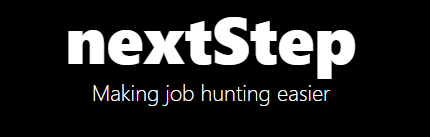

# nextStep


A Comprehensive job and career development platfrom for graduates

## Features

- **community section**: 
- **professional feedbacks**: 
- **career pathway**: 
- **Dynamic Skills**: 
- **Admin Controls**: 

## Table of Contents
- [Installation](#installation)
- [Usage](#usage)
- [Technologies Used](#technologies-used)
- [Contributing](#contributing)
- [License](#license)

## Installation

### Prerequisites

- Node.js and npm (or yarn) must be installed on your machine.
- ⚠️MongoDB for the backend database (can be hosted locally or using a cloud service like MongoDB Atlas).

### Steps

1. Clone the repository:

    ```bash
    git clone https://github.com/AKKSHAAT/nextStep.git
    cd nextStep
    ```

2. Install dependencies for both the frontend and backend.

   - For the frontend (React):
   
     ```bash
     npm install
     ```

   - For the backend (Node.js, Express):
   
     ```bash
     cd backend
     npm install
     ```

3. Set up environment variables for the backend in `backend/.env` file for MongoDB URI, JWT secret key).

4. Start the server and client:

   - Start the backend :
  `in /backend dir`
     ```bash
     npm run dev
     ```

   - Start the frontend (React):
    `in root dir`
       ```bash
     npm run dev
     ```

## Usage

- **Student Dashboard**: Students can view a list of jobs, see job details, and apply directly to the roles.
- **Job Details Page**: Shows the role, required skills, and organization.
- **community Page**:  a community section so students can interact with recruiters

## Technologies Used

- **Frontend**:
  - React
  - Tailwind CSS (for styling)
  - React Router (for routing)
  - Axios (for API requests)
  
- **Backend**:
  - Node.js
  - Express.js
  - MongoDB (for database)
  - JWT (for authentication)

## Contributing

1. Fork the repository.
2. Create a new branch (`git checkout -b feature-name`).
3. Make your changes and commit them (`git commit -am 'Add feature'`).
4. Push to your branch (`git push origin feature-name`).
5. Create a new Pull Request.

## License

This project is licensed under the MIT License